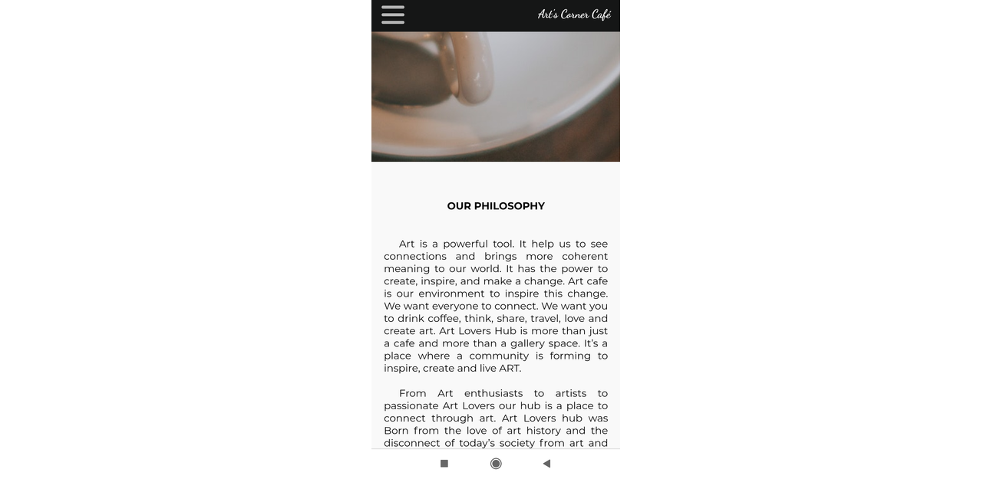

# Cafe Website

## Table of contents
* [General info](#general-info)
* [Technologies](#technologies)
* [Setup](#setup)
* [Status](#status)
* [Contact](#contact)

## General info
This is responisive website template using react-router.

## Technologies
* HTML5
* CSS
* React JS
* ESlint
* Firebase

## Setup
To run this project, install it locally using npm:

* Clone this repository
$ git clone https://github.com/ewelina-slepko/cafe-website

* Go into the repository
$ cd cafe-website

* Install dependencies
$ npm install

* Run the app
$ npm start

* Website - [page](https://arts-corner-cafe.web.app/)

## Status
Project is: _in progress_.

## Contact
Created by Ewelina Ślepko (slepko.ewelina@gmail.com) - feel free to contact me!
